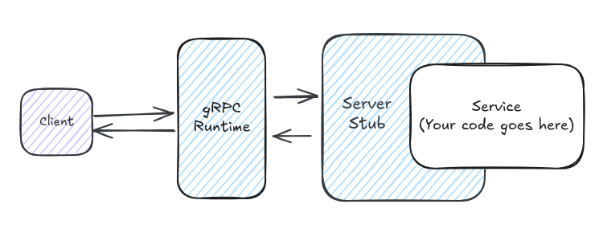

# Learning gRPC

Victor Martinez

---

# First, what is RPC?

An idea to extend transfer of control and transmission of data from one machine to another.


[http://birrell.org/andrew/papers/ImplementingRPC.pdf](http://birrell.org/andrew/papers/ImplementingRPC.pdf)

note:

- The concept dates back to 1976 [1]
- Paper written by ANDREW D. BIRRELL and BRUCE JAY NELSON 

- Back in the days building network application required big expertise and was not user friendly
- They wanted to make it as easy to call a remote service as a local one, very user friendly
- They wanted to make it efficient (Networks were very slow)
- They wanted to make it secure (Networks were not secure)
- RPCRuntime is also known as RPC communications package

- In that lab, the user-stub and server-stub used to be generated by a program called Lupine.

[1] WHITE, J. E. A high-level framework for network-based resource sharing. In Proc. National Computer Conference, (June 1976).

---


*gRPC is a modern open source high performance Remote Procedure Call (RPC) framework that can run in any environment.*

[https://grpc.io/](https://grpc.io/)

note:

- google Remote procedure calls
- Initially created by Google
- Used to connect microservices across data centers
- It used to be called Stubby
- In march 2015 they decided to build and publish a next version called gRPC and make it open source

---

# Why a framework?



gRPC dictates how you will build your network interface.

Code is generated for you batteries included, you must only fill the gaps.

note:

- All the underlying details about networking, encoding & more is handled for you.
- For clients the feeling must be more of a library one.
- Some implementations wrap the original C library, some don't.

---

## Built on top of HTTP2

So we get for free
- **Multiplexing**
- Header **compression**
- **Server push**
- **TLS**

note:

Multiplexing & server push are especially relevant in gRPC

---


## 4 types of RPC supported


---
## Metadata

Key-value pairs of data used to provide additional information about a call.

Implemented using HTTP/2 headers.

[https://github.com/grpc/grpc/blob/master/doc/PROTOCOL-HTTP2.md](https://github.com/grpc/grpc/blob/master/doc/PROTOCOL-HTTP2.md)

note:

- gRPC metadata can be sent and received by both the client and the server.
- Headers are sent from the client to the server before the initial request.
- Headers are sent from the server to the client before the initial response of an RPC call.
- The links shows a document specifying supported values as metadata.
- Can be useful for: Authentication & tracing.

---
## And many more features

- Service-specific **health checking**
- Request **interceptors**
- **Reflection** for better debugging & discoverability
- Configurable call **retries** via retry policies
- RPC **cancellations**
- **Flow control** for streaming
- Client RPC **load balancing**
- ...

note:

- Features might differ from language to language

- **Flow control**: mechanism to ensure that a receiver of messages does not get overwhelmed by a fast sender
- **Reflection**: Allows for clients without the generated client code to discover the gRPC services on the fly
- **Health check**: A service is provided to monitor the health of specific services in your server
- **Retries**:
    - Enabled by default, with no default retry policy.
    - By default retries low-level race conditions
    - By default transparent retries are made:
        - If the RPC never left the client
        - If the RPC never reached the server application logic
---

# Protocol buffers

*Protocol Buffers are language-neutral, platform-neutral extensible mechanisms for serializing structured data.*

https://protobuf.dev/

note:

- Also developed by google
- Default serialization format supported by gRPC
- Interface Definition Language supported by gRPC

[2] https://en.wikipedia.org/wiki/Interface_description_language

---

## They are a combination of

- The **Interface Definition Language**
- The compiler that **generates code** from IDL files
- Language-specific **runtimes**
- The **serialization format**

note:

Explain what an IDL is

Here we will focus on the IDL and the tooling, we won't focus on the serialization format.

---

## Remarkable features of Protocol buffers

- **Strongly typed** data
- **Language** and **platform neutral**
- **Compact binary format**
- Support for **RPC service definition**
- **Backward** and **Forward compatibility**

note:

Compatibility notes:
    - Field deletion compatibility is supported at a syntax level
        - Via the use of a special keyword
    - Fields not found will be set a default value always
    - Extra not supported fields will be ignored

---

## Defining messages

```protobuf
syntax = "proto3";

package decline_renewal.request.v1;

import "google/protobuf/timestamp.proto";

message DeclineRenewalRequest {
  string policy_id = 1;
  google.protobuf.Timestamp requested_at = 2;
  optional string description = 3;
  oneof reason {
    CustomerDeclineRenewalReason customer = 4;
  }
}

enum CustomerDeclineRenewalReason {
  CUSTOMER_DECLINE_RENEWAL_REASON_UNSPECIFIED = 0;
  CUSTOMER_DECLINE_RENEWAL_REASON_COMPETITOR_OFFER = 1;
  CUSTOMER_DECLINE_RENEWAL_REASON_VEHICLE_SOLD = 2;
  CUSTOMER_DECLINE_RENEWAL_REASON_VEHICLE_NOT_PURCHASED = 3;
  CUSTOMER_DECLINE_RENEWAL_REASON_VEHICLE_DEREGISTRATION = 4;
  CUSTOMER_DECLINE_RENEWAL_REASON_NO_INSURANCE_WANTED = 5;
  CUSTOMER_DECLINE_RENEWAL_REASON_DOES_NOT_KNOW = 6;
  CUSTOMER_DECLINE_RENEWAL_REASON_WANTS_GREEN_CARD = 7;
  CUSTOMER_DECLINE_RENEWAL_REASON_INCORRECT_EFFECTIVE_DATE = 8;
  CUSTOMER_DECLINE_RENEWAL_REASON_INCORRECT_PERSONAL_DATA = 9;
  CUSTOMER_DECLINE_RENEWAL_REASON_INCORRECT_DATA_OTHER = 10;
}
```

note:

- Fields are uniquely identified with a numeric tag.
- When deleting fields, their tag must be marked as reserved to ensure its never used again
- Enums must always have a 0 variant "UNSPECIFIED" to be used as the default value
- The engineer must follow a set of good practices to ensure backward/forward compatibility, not everything can be enforced by the compiler

---

## Defining messages

```protobuf
syntax = "proto3";

package decline_renewal.response.v1;

message DeclineRenewalResponse {
  string policy_id = 1;
}  
```

---

## Defining a service

```protobuf
syntax = "proto3";

package service.v1;

import "es_policy_grpc/messages/amend_termination/request/v1/request.proto";
import "es_policy_grpc/messages/amend_termination/response/v1/response.proto";
// Skipping other imports for the sake of the slide

service PolicyManagementService {
  rpc AmendTermination(amend_termination.request.v1.AmendTerminationRequest)
    returns (amend_termination.response.v1.AmendTerminationResponse);

  rpc TerminatePolicy(terminate_policy.request.v1.TerminatePolicyRequest)
    returns (terminate_policy.response.v1.TerminatePolicyResponse);

  rpc WithdrawPolicy(withdraw_policy.request.v1.WithdrawPolicyRequest)
    returns (withdraw_policy.response.v1.WithdrawPolicyResponse);

  rpc DeclineRenewal(decline_renewal.request.v1.DeclineRenewalRequest)
    returns (decline_renewal.response.v1.DeclineRenewalResponse);
}
```

note:

- Importing other definitions is allowed
- "proto3" is the recommended edition to use
- Packages have to define a namespace
- Service definition is supported by the language as we see above
- The 4 types of RPC are supported, above we only see Unary RPCs

---
## The protoc compiler

Compiles `.proto` files into code.
Supports plugins for different languages.

```bash
protoc --proto_path=src --python_out=build/gen src/foo.proto
```

note:

`--proto_path` specifies the source directory, `--*_out` the destination directory, and the rest is the path to your `.proto`

---
## Buf CLI

- A **linter** for proto files
- A **formatter** for proto files
- A system to organize your proto files by **workspaces**
- A feature to check for **breaking changes** in your definitions
- A **plugin system** to compile proto files into multiple formats
- **Editor integration**
- And more!

[https://buf.build/product/cli](https://buf.build/product/cli)

note:

- Builds on top of protoc
- Provides a very easy to use plugin and build system

---

# gRPC in the Rust ecosystem


:heart:


---
# Tower


*Library of modular and reusable components for building robust networking clients and servers*

note:

- It exposes already a set of basic reusable services to solve common networking patterns such as timeouts and rate limiting.

---
## Tower service

```rust
pub trait Service<Request> {
    type Response;
    type Error;
    type Future: Future<Output = Result<Self::Response, Self::Error>>;

    fn poll_ready(&mut self, cx: &mut Context<'_>) -> Poll<Result<(), Self::Error>>;
  
    fn call(&mut self, req: Request) -> Self::Future;
}
```

note:

- Tower’s fundamental abstraction.
- An asynchronous function from a `Request` to a `Response`.
- It immediately returns a `Future` representing the eventual completion of processing the request.
- It is a simplified interface making it easy to write network applications in a modular and reusable way, decoupled from the underlying protocol.

---
## Layers

```rust
pub trait Layer<S> {
    type Service;
    
    fn layer(&self, inner: S) -> Self::Service;
}
```

note:

- A mechanism to layer services.
- It is used to wrap services building this way a "layer" pattern

---
## Building a layered service

```rust
ServiceBuilder::new()
    .layer(TimeoutLayer::new(Duration::from_secs(10)))
    .layer(OpenTelemetryTracingLayer::new())
    .layer(JwtAuthLayer::new(jwks_client, "starsky"))
    .service(PolicyManagementServerStub::new(service));
```

note:

A real example of a layered service. Slightly simplified for the sake of the presentation.

---

## Building a layered service


---
# Tonic


*A gRPC over HTTP/2 rust implementation focused on high performance, interoperability, and flexibility*

[https://github.com/hyperium/tonic](https://github.com/hyperium/tonic)

note:

- Build on top of Tower
- It has first class support for async/await.

---
## Features

- **Health check** of services
- **Interceptors** 
- **Reflection**
- **Stub generation** from protos
- RPC cancellation via **timeouts**
- Request/Response **compression**
- Extensible via **Tower** services
- ...

note:

- We will focus on code generation, service implementation and client-server implementation
- Later we will see examples of implementing middleware using Tower Layers

---

## Let's build a library with generated Rust code

---
## Generating code from Proto definitions :gear:

```rust
// build.rs
let mut prost_build = prost_build::Config::new();
prost_build.protoc_arg("--experimental_allow_proto3_optional");
prost_build.compile_protos(
    &[
        "proto/es_policy_grpc/messages/terminate_policy/request/v1/request.proto",
        "proto/es_policy_grpc/messages/terminate_policy/response/v1/response.proto",
        "proto/es_policy_grpc/messages/withdraw_policy/request/v1/request.proto",
        "proto/es_policy_grpc/messages/withdraw_policy/response/v1/response.proto",
        "proto/es_policy_grpc/messages/decline_renewal/request/v1/request.proto",
        "proto/es_policy_grpc/messages/decline_renewal/response/v1/response.proto",
        "proto/es_policy_grpc/messages/amend_termination/request/v1/request.proto",
        "proto/es_policy_grpc/messages/amend_termination/response/v1/response.proto",
    ],
    &["proto"],
)?;

tonic_build::configure()
    .protoc_arg("--experimental_allow_proto3_optional")
    .compile_protos(
        &["proto/es_policy_grpc/service/v1/service.proto"],
        &["proto"],
    )
    .unwrap();
```

note:

- prost_build generates types from the message definitions
- tonic_build generates the Client & Server stubs

---

## Generated types

<div class="row">
<div class="column">

```rust
// Generated Request
pub struct DeclineRenewalRequest {
    pub policy_id: String,
    pub requested_at: Option<Timestamp>,
    pub description: Option<String>,
    pub reason: Option<Reason>,
}

pub enum Reason {
    Customer(i32),
}

// Generated Response
pub struct DeclineRenewalResponse {
    pub policy_id: String,
}    
```
</div>

<div class="column">

```rust
#[repr(i32)]
pub enum CustomerDeclineRenewalReason {
    Unspecified = 0,
    CompetitorOffer = 1,
    VehicleSold = 2,
    VehicleNotPurchased = 3,
    VehicleDeregistration = 4,
    NoInsuranceWanted = 5,
    DoesNotKnow = 6,
    WantsGreenCard = 7,
    IncorrectEffectiveDate = 8,
    IncorrectPersonalData = 9,
    IncorrectDataOther = 10,
    PaymentMethodOrDate = 11,
    DeceasedPolicyHolder = 12,
    CoverageChange = 13,
    DissatisfactionService = 14,
    UnderwritingRules = 15,
    MovingToAnotherCountry = 16,
    ProductService = 17,
    PolicyHolderChange = 18,
    PriceIncrease = 19,
    Other = 20,
}    
```
</div></div>

note:

- Most fields are generated as Option due to the backward/forward compatibility nature of Protobuf

---

## Generated types

```rust
pub trait PolicyManagementService {
    async fn decline_renewal(
        &self,
        request: Request<DeclineRenewalRequest>,
    ) -> Result<Response<DeclineRenewalResponse>, Status>
	// ...
}
```

---
## Exposing the generated code as a library

```rust
// lib.rs

pub mod messages {
    pub mod decline_renewal {
        pub mod request {
            pub mod v1 {
                include!(concat!(env!("OUT_DIR"), "/es_policy_grpc.messages.decline_renewal.request.v1.rs"));
            }
        }

        pub mod response {
            pub mod v1 {
                include!(concat!(env!("OUT_DIR"), "/es_policy_grpc.messages.decline_renewal.response.v1.rs"));
            }
        }
    }
    // ..
}

pub mod policy_service {
    pub mod v1 {
        include!(concat!(env!("OUT_DIR"), "/es_policy_grpc.service.v1.rs"));
    }
}
```

note:

- We must expose the generated code through our lib.rs when building a library

---

## Let's build a gRPC application

---

## Filling the gaps

```rust
use es_policy_grpc::policy_service::v1::PolicyManagementService;
use es_policy_grpc::messages::decline_renewal::request::v1::DeclineRenewalyRequest;
use es_policy_grpc::messages::decline_renewal::response::v1::DeclineRenewalResponse;
use tonic::{Request, Response, Status};

pub struct PolicyManagementServiceImpl {
    application: Arc<dyn ApplicationServices>,
}

impl PolicyManagementService for PolicyManagementServiceImpl {
    async fn decline_renewal(
        &self,
        request: Request<DeclineRenewalRequest>,
    ) -> Result<Response<DeclineRenewalResponse>, Status> {
        let request = request.into_inner();

        let policy_id = Uuid::parse_str(&request.policy_id).unwrap();

        let policy = self.application.find_policy(policy_id).await.unwrap();

        let details: TerminateDetails = request.try_to_domain(policy.expiration_date()).unwrap()

        self.application.cancel_policy(policy_id.into(), details).await;

        Ok(Response::new(DeclineRenewalResponse {
            policy_id: policy_id.to_string(),
        }))
    }
    // ..
}

```

---
## Building the server

```rust
use tonic::Server as GrpcServer;
use es_policy_grpc::policy_service::v1::PolicyManagementServiceServer as PolicyManagementServerStub;

let server = 
	// gRPC server provided by Tonic
	GrpcServer::builder() 
		.add_service(
			// Generated Policy Management Server Stub
			PolicyManagementServerStub::new(
				// Implementation of the service
				PolicyManagementServiceImpl::new(application)
			)
    ).add_service(
        QuotingServerStub::new(
            QuoteServiceImpl::new(application)
        )
    );

let listener = TcpListener::bind(("0.0.0.0", grpc_port)).await?;

server.serve(listener).await?;
```

note:

Simple build of a Tonic Server.

- The GrpcServer acts as a Router.
- The GrpcServer doesn't know how to unpack-pack messages, that is handled by each specific server stub.
- The GrpcServer will be listening to a TCP port like an HTTP2 server.

---

## Building the client

```rust
use es_policy_grpc::policy_service::v1::PolicyManagementServiceClient as PolicyManagementClientStub;
use tonic::{metadata::MetadataValue, Request};
use es_policy_grpc::messages::decline_renewal::request::v1::{
    DeclineRenewalRequest,
    DeclineRenewalReason,
    CustomerDeclineRenewalReason
};

// Auto-generated client stub
let mut client = PolicyManagementClientStub::connect("http://localhost:50051").await?;

let mut request = Request::new(DeclineRenewalRequest {
    policy_id: uuid::Uuid::new_v4(),
    requested_at: DateTime::now(),
    description: Some("dummy".into()),
    reason: DeclineRenewalReason::Customer(
        CustomerDeclineRenewalReason::VehicleSold
    )
});

let token: MetadataValue<_> = "Bearer some-auth-token".parse()?;

request.metadata_mut.insert(http::AUTHORIZATION, token);

let _response = client.generate_contract(request).await?;
```

note:

- We use the Metadata feature to set authorization headers to the request
- The ClientStub exposes the same API we defined in our protobuf service definition
- It handles all the packing-unpacking as well as the network

---

---

# Building middleware with Tower

So, how can we take advantage of Tower in gRPC?

---

## Authorization middleware

Auth0 M2M authorization

---
## Authentication service

```rust
// Tower Service used as a JWT Auth middleware.
pub struct JwtAuth<T: JwtDecoder, S> {
    jwt_decoder: Arc<T>,
    audience: String,
    inner: S,
}
```

note:

First we build a struct that will contain a generic inner service protected by our auth service.

The audience represents the audience set in Auth0, which is our API identifier.

The JwksClient contains the public keys to verify the signature of incoming tokens.

---

## Authentication service

```rust
impl<T: JwtDecoder, S> JwtAuth<T, S> {
    async fn authorize<Req, Res>(&self, req: http::Request<Req>) -> Result<http::Request<Req>, http::Response<Res>>
    where
        Res: Default,
    {
        let token = req.headers()
            .get(http::AUTHORIZATION)
            .ok_or_else(make_unauthorized_response)?
            .strip_prefix("Bearer ")
            .ok_or_else(make_unauthorized_response)?

        if let Err(_err) = self.jwt_decoder.decode::<serde_json::Value>(token, &self.audience).await {
            return Err(make_unauthorized_response());
        }

        Ok(req)
    }
}
```

note:

Here we implement the authentication logic, we are not implementing yet the service trait.

I've simplified the code for the sake of the slide.

We assume that `make_unauthorized_response` will build a gRPC unauthorized response.

---

## Authentication service

```rust
use std::task::{Context, Poll};
use http::{Request, Response};

impl<Req, Res, S, T> Service<Request<Req>> for JwtAuth<T, S>
where
    S: Service<Request<Req>, Response = Response<Res>>,
    T: JwtDecoder,
    // .. Skipping other constraints
{
    type Response = S::Response;
    type Error = S::Error;
    type Future = BoxFuture<'static, Result<Self::Response, Self::Error>>;

    fn poll_ready(&mut self, cx: &mut Context<'_>) -> Poll<Result<(), Self::Error>> {
        self.inner.poll_ready(cx)
    }

    fn call(&mut self, req: Request<Req>) -> Self::Future {
        let mut this = self.clone();

        async move {
            match this.authorize(req).await {
                Ok(req) => this.inner.call(req).await,
                Err(res) => Ok(res),
            }
        }
        .boxed()
    }
}
```

note:

Note the use of `async move` inside `call` given that `call` is not defined as an async function on the trait definition

---

## Authentication layer

```rust
// Reusable Tower Layer meant to wrap
// a JWT Auth middleware Service around a generic service
pub struct JwtAuthLayer<T: JwtDecoder> {
    jwt_decoder: Arc<T>,
    audience: String,
}

impl<T: JwtDecoder> JwtAuthLayer<T> {
    pub fn new(jwt_decoder: T, audience: impl Into<String>) -> Self {
        Self {
            jwt_decoder: Arc::new(jwt_decoder),
            audience: audience.into(),
        }
    }
}
```

note:

Although confusing, the purpose of the layer is to make the usage of the middleware more user-friendly

---

## Authentication layer

```rust
impl<T, S> Layer<S> for JwtAuthLayer<T>
where
    T: JwtDecoder,
{
    type Service = JwtAuth<T, S>;

    fn layer(&self, inner: S) -> Self::Service {
        JwtAuth {
            jwt_decoder: self.jwt_decoder.clone(),
            audience: self.audience.clone(),
            inner,
        }
    }
}
```

note:

What is done inside of the `layer` function could just be done manually, but it is done here for better user experience later.

---
## Attaching it to our gRPC server

```rust
use es_policy_grpc::policy_service::v1::PolicyManagementServiceServer as PolicyManagementServerStub;
use tonic::Server as GrpcServer;
use tower::ServiceBuilder;

// ...

let authenticated_apis = ServiceBuilder::new()
    .layer(JwtAuthLayer::new(jwks_client, AUDIENCE))
    .service(PolicyManagementServerStub::new(
        PolicyManagementServiceImpl::new(application),
    ));

let server = GrpcServer::builder().add_service(authenticated_apis);
```

note:

Simplified version of our real server implementation in `es-be`

---
## Tracing Layer

Let's build another Tower service.

Interceptors are not the best fit, we want to trace responses too.

---

## Building a span from a request

```rust
fn make_span<B>(request: &http::Request<B>) -> tracing::Span {
    // We'll assume server_info() works
    let ServerInfo { host, port, .. } = server_info(request);

    let mut headers = request.headers();

    let name = request.uri().path().trim_start_matches('/');

    let (service, method) = name
        .split_once('/')
        .expect("gRPC paths should be formatted as $service/$method");

    tracing::info_span!(
        "gRPC request",
        otel.name = %name,
        rpc.grpc.request.metadata = ?headers,
        rpc.method = method,
        rpc.service = service,
        rpc.system = "grpc",
        server.address = %host,
        server.port = port,
        span.kind = "server",
        // set by the response span
        otel.status_code = tracing::field::Empty,
        rpc.grpc.response.metadata = tracing::field::Empty,
        rpc.grpc.status_code = tracing::field::Empty,
    )
}
```

note:

Explain how this is a simplified version of the real implementation in `prima_tower`

---

## Updating the span with the response

```rust
fn on_response<B>(response: &http::Response<B>, span: &tracing::Span) {
    let mut headers = response.headers().clone();
    redact_sensitive_headers(&mut headers);

    let code = tonic::Status::from_header_map(&headers)
        .map(|status| status.code())
        .unwrap_or(tonic::Code::Ok);

    span.record("rpc.grpc.status_code", code as i32);
    span.record("grpc.response.header", format!("{:?}", headers));

    if matches!(
        code,
        tonic::Code::Unknown
            | tonic::Code::DeadlineExceeded
            | tonic::Code::Unimplemented
            | tonic::Code::Internal
            | tonic::Code::Unavailable
            | tonic::Code::DataLoss
    ) {
        span.record("otel.status_code", "ERROR");
    }
}
```

note:

We will see in a second how the span we receive by parameters is the same span we created when handling the request

---

## Tracing service

```rust
// Tower Service acting as a Tracing middleware
// for gRPC requests and responses
pub struct OpenTelemetryTracer<S> {
    inner: S,
}
```

note:

We need to implement the service that will act as the tracing middleware

---

## Tracing service

```rust
use std::task::{Context, Poll};
use http::{Request, Response};
use opentelemetry_http::HeaderExtractor;
use opentelemetry_sdk::propagation::TraceContextPropagator;

impl<Req, Res, S> Service<Request<Req>> for OpenTelemetryTracer<S>
where
    S: Service<Request<Req>, Response = Response<Res>>,
    S::Future: Send + 'static,
{
    type Response = S::Response;
    type Error = S::Error;
    type Future = BoxFuture<'static, Result<Self::Response, Self::Error>>;

    fn poll_ready(&mut self, cx: &mut Context<'_>) -> Poll<Result<(), Self::Error>> {
        self.inner.poll_ready(cx)
    }

    fn call(&mut self, req: Request<Req>) -> Self::Future {
        let parent_context = TraceContextPropagator::new().extract(&HeaderExtractor(req.headers()));

        let span = make_span(&req);
        span.set_parent(parent_context);

        self.inner.call(req).instrument(span.clone()).inspect_ok(move |response| {
            on_response(response, &span);
        })
        .boxed()
    }
}
```

note:

Again, the code is simplified for the slides purpose.

Note how the same span is used to track the request and response.

Then that span is used as the parent span for the inner service call.

---
## Tracing layer

```rust
pub struct OpenTelemetryTracingLayer {}

impl OpenTelemetryTracingLayer {
    pub fn new() -> Self {
        Self {}
    }
}
```

note:

As we've mentioned, layers exist for better development experience, services could be layered manually.

In this case we don't need any data to be added to the layer.

---
## Tracing layer

```rust
impl<S> Layer<S> for OpenTelemetryTracingLayer {
    type Service = OpenTelemetryTracer<S>;

    fn layer(&self, inner: S) -> Self::Service {
        OpenTelemetryServerTracing { inner }
    }
}
```

---
## Attaching it to our gRPC server

```rust
use tonic::Server as GrpcServer;

GrpcServer::builder()
    .layer(OpenTelemetryTracingLayer::new())
    // layer other services to benefit from tracing
    .serve(addr)
    .await?;   
```

note:

It is this simple :)

---

## Extras

Did we get here? :eyes:

---

## Health checking gRPC services

Tonic provides a health check service implementing a standard gRPC health checking protocol.

[https://github.com/grpc/grpc/blob/master/doc/health-checking.md](https://github.com/grpc/grpc/blob/master/doc/health-checking.md)

note:

A GRPC service is used as the health checking mechanism. 

Since it is a GRPC service itself, doing a health check is in the same format as a normal rpc. 

It has rich semantics such as per-service health status. 

The server has full control over the access of the health checking service.

---
## Health service definition

```protobuf
syntax = "proto3";

package grpc.health.v1;

message HealthCheckRequest {
  string service = 1;
}

message HealthCheckResponse {
  enum ServingStatus {
    UNKNOWN = 0;
    SERVING = 1;
    NOT_SERVING = 2;
    SERVICE_UNKNOWN = 3; // Used only by the Watch method.
  }
  ServingStatus status = 1;
}

service Health {
  rpc Check(HealthCheckRequest) returns (HealthCheckResponse);
  rpc Watch(HealthCheckRequest) returns (stream HealthCheckResponse);
}
```

[https://github.com/grpc/grpc/blob/master/doc/health-checking.md](https://github.com/grpc/grpc/blob/master/doc/health-checking.md)

note:

- Official service definition from the gRPC documentation
- Some languages might implement it and others might not

---
## Enabling the health service

```rust
use es_policy_grpc::policy_service::v1::PolicyManagementServiceServer as PolicyManagementServerStub;
use tonic_health::server::health_reporter;
use tonic::Server as GrpcServer;

let (health_reporter, health_service) = health_reporter();

health_reporter
    .set_serving::<PolicyManagementServerStub<PolicyManagementServiceImpl>>()
    .await;

GrpcServer::builder()
	// Add other layers
	.layer(..)
	.add_service(health_service)
	.serve(addr)
	.await?;
```

note:

Make it clear that we are using the `tonic-health` crate which doesn't come by default with `tonic`.

---

## Interceptors

Interceptors are similar to middleware but with less flexibility.
They allow you to:
- Add/remove/check items in the metadata of each request. 
- Cancel a request with a `Status`.
---

## Interceptors in practice

```rust
use es_policy_grpc::policy_service::v1::PolicyManagementServiceServer as PolicyManagementServerStub;
use tonic::{metadata::MetadataValue, Request, Response, Status};

fn check_auth(req: Request<()>) -> Result<Request<()>, Status> {
    match req.metadata().get(http::AUTHORIZATION) {
        Some(t) if is_valid(t) => Ok(req),
        _ => Err(Status::unauthenticated("No valid auth token")),
    }
}

let svc = PolicyManagementServerStub::with_interceptor(
	PolicyManagementServiceImpl::new(application),
	check_auth
);
```

---

# Thank you for your time 

:heart:
