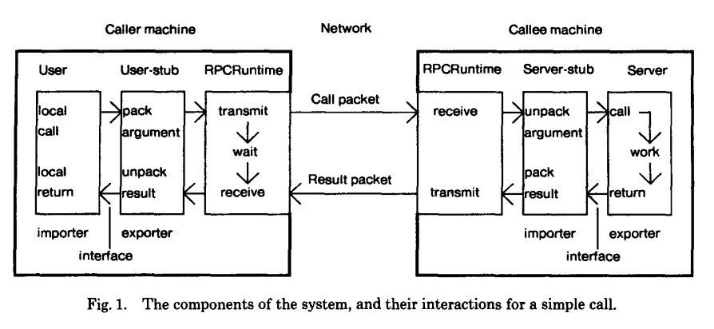

---
---

# Learning gRPC

Victor Martinez

---
## First, what is RPC?

Remote Procedure Calls.

An idea to extend transfer of control and transmission of data from one machine to another.

<a style="font-size: 20px;" href="http://birrell.org/andrew/papers/ImplementingRPC.pdf">
http://birrell.org/andrew/papers/ImplementingRPC.pdf
</a>


note: At the time, building applications that required communicating with a separate machine was difficult and required big expertise, so much that only a few network experts were designated to.
One of the aims of this RPC implementation was to make it highly efficient (network-wise) as well as as simple to use as non-remote procedures.

They believed that by providing a simple interface and tool for machine to machine communications, it would make it more accessible for less expert people to implement distributed applications.

Also, they aimed to provide secure communications with RPC. At the time, none of the implemented protocols inside their network had no security at all to the point where passwords were being sent as plain text.

The concept dates back to 1976 [1]

[1] WHITE, J. E. A high-level framework for network-based resource sharing. In Proc. National Computer Conference, (June 1976).

---


<a style="font-size: 20px;" href="http://birrell.org/andrew/papers/ImplementingRPC.pdf">
http://birrell.org/andrew/papers/ImplementingRPC.pdf
</a>

note: 

Back in the time they already used a tool to auto-generate the client and server stubs:

`But the user-stub and server-stub are automatically generated, by a program called Lupine.`

---
### Interface Definition Language

```protobuf
struct Phone {
  1: i32 id,
  2: string number,
}

service PhoneService {
  Phone findById(1: i32 id),
  list<Phone> findAll()
}
```

<p style="font-size: 26px;">
An example of Thrift, an IDL used in Facebook's RPC framework
</p>

<a style="font-size: 20px;" href="https://github.com/facebook/fbthrift">
https://github.com/facebook/fbthrift
</a>


note:

Many IDLs have been developed over time. Mozilla, Microsoft, IBM... and more developed their own internal RPC frameworks with their own IDLs [2]

In the paper mentioned above, they wrote the interface using the Mesa interface modules feature:

`This generation is specified by use of Mesa interface modules. These are the basis of the Mesa (and Cedar) separate compilation and binding mechanism [9]. An interface module is mainly a list of procedure names, together with the types of their arguments and results`

[2] https://en.wikipedia.org/wiki/Interface_description_language

---


*gRPC is a modern open source high performance Remote Procedure Call (RPC) framework that can run in any environment.*

<a style="font-size: 26px;" href="https://grpc.io/">
https://grpc.io/
</a>

note:

google Remote procedure calls

"gRPC was initially created by Google, which has used a single general-purpose RPC infrastructure called **Stubby** to connect the large number of microservices running within and across its data centers. In March 2015, Google decided to build the next version of Stubby and make it open source. The result was **gRPC**"

---

### Why a framework?

gRPC dictates how you will build your network interface.

Code is generated for you batteries included, you must only fill the gaps.

note:

All the underlying details about networking, encoding & more is handled for you.

It is more a framework in the sense of servers. They must use the generated Server Stub, with the only need of implementing the Service interfaces.

Clients will use the generated client Stub. For them the gRPC code will be less intrusive and will feel more like a library

Some implementations wrap the original C library, some don't.

---

### Built on top of HTTP2

So we get for free
- **Multiplexing**
- Header **compression**
- **Server push**
- **TLS**

note:

Explain multiplexing and server push

---

### 4 types of RPC supported


note:

Explain that each of these RPC types can be specified on the protobuffers IDL

---
### Metadata

Key-value pairs of data used to provide additional information about a call.

Implemented using HTTP/2 headers.

<a style="font-size: 20px;" href="https://github.com/grpc/grpc/blob/master/doc/PROTOCOL-HTTP2.md">
https://github.com/grpc/grpc/blob/master/doc/PROTOCOL-HTTP2.md
</a>

note:

gRPC metadata can be sent and received by both the client and the server. Headers are sent from the client to the server before the initial request and from the server to the client before the initial response of an RPC call.

On the link I show, they document the supported values for metadata

Can be useful for: Authentication & tracing

---
### And many more features

- **Flow control** for streaming
- RPC automatic & manual **cancellations**
- **Reflection** (Service discoverability & ease debugging)
- **Load balancing** (Client requests can be load balanced between multiple servers)
- Call **retries**
- **Health checking** (Service-specific health checking)
- **Interceptors** (Middleware for RPCs)

note:

It is important to explain that these features might differ from language to language, since it depends completely on how each of them implements gRPC

- **Flow control** is a mechanism to ensure that a receiver of messages does not get overwhelmed by a fast sender. Flow control prevents data loss, improves performance and increases reliability.

- **Reflection**: Explain that we won't go in detail about reflection but that I believe we should research more about it since it can be useful for better developer experience

- **Health check**: gRPC specifies a standard service API ([health/v1](https://github.com/grpc/grpc-proto/blob/master/grpc/health/v1/health.proto)) for performing health check calls against gRPC servers. An implementation of this service is provided, but you are responsible for updating the health status of your services. It is pluggable, and some languages might not provide it.
---
### Protocol buffers

*Protocol Buffers are language-neutral, platform-neutral extensible mechanisms for serializing structured data.*

https://protobuf.dev/

note:

Explain that it is the default binary serialization format supported by gRPC

It is also developed by google.

---

### They are a combination of

- The **Interface Definition Language**
- The compiler that **generates code** from IDL files
- Language-specific **runtimes**
- The **serialization format**

note:

Here we will focus on the IDL and the tooling, we won't focus on the serialization format.

---
### Protobufs as an Interface Definition Language
---

### Defining a service

```protobuf
// service/v1/service.proto
syntax = "proto3";

package service.v1;

import "amend_termination/request/v1/request.proto";
import "amend_termination/response/v1/response.proto";

service PolicyManagementService {
  rpc AmendTermination(amend_termination.request.v1.AmendTerminationRequest) returns (amend_termination.response.v1.AmendTerminationResponse);
}
```

---
### Defining messages

```protobuf
// amend_termination/request/v1/request.proto
syntax = "proto3";

package amend_termination.request.v1;

import "terminate_policy/request/v1/request.proto";
import "google/protobuf/timestamp.proto";

message AmendTerminationRequest {
  string policy_id = 1;
  google.protobuf.Timestamp requested_at = 2;
  google.protobuf.Timestamp interruption_at = 3;
  optional string description = 4;
  oneof reason {
    terminate_policy.request.v1.CustomerTerminateReason customer = 5;
    terminate_policy.request.v1.PrimaTerminateReason prima = 6;
  }
}
```

---
### The protoc compiler

Compiles `.proto` files into code.
Supports plugins for different languages.

```bash
protoc --proto_path=src --python_out=build/gen src/foo.proto
```

note:

`--proto_path` specifies the source directory, `--*_out` the destination directory, and the rest is the path to your `.proto`

---
### Buf CLI

- A **linter** for proto files
- A **formatter** for proto files
- A system to organize your proto files by **workspaces**
- A feature to check for **breaking changes** in your definitions
- A **plugin system** to compile proto files into multiple formats
- **Editor integration**
- And more!

<a style="font-size: 20px;" href="https://buf.build/product/cli">
https://buf.build/product/cli
</a>

note:

Explain that it builds on top of protoc. Be very short here, just mention the tool briefly. It is important because we use it.

---

### Buf CLI

```bash
buf format
```

```bash
buf lint
```

```bash
buf breaking --against ".git#branch=master"
```


---
### Remarkable features of Protocol buffers

- **Strongly typed** data
- **Language** and **platform neutral**
- **Compact binary format**
- **Backward and Forward compatibility**
- Support for **RPC service definition**

note:

Give a short example of why it is backward and forward compatible. Mention tags.

---
## gRPC in the Rust ecosystem


:heart:


---
# Tonic


<br />

<a style="font-size: 24px;" href="https://github.com/hyperium/tonic">
https://github.com/hyperium/tonic
</a>

note:

Built on top of Tower, Tonic is a gRPC over HTTP/2 implementation focused on **high performance**, **interoperability**, and **flexibility**.

It has first class support for async/await.

The main goal of tonic is to provide a generic gRPC implementation over HTTP/2 framing. 

Codegen tools need to be used to generate the client and server stubs that will encode and decode the binary data and deal with other gRPC features such as streaming.

---
### Features

- **TLS**
- **Load balancing**
- RPC cancellation via **timeouts**
- Request/Response **compression**
- Bidirectional **streaming**
- **Health check** of services
- **Interceptors** 
- **Reflection**
- Client & Server **stub generation**
- Extensible via **Tower** services

note:

These are only a few notable features, it provides more for sure

---
### Generate code from Proto definitions :gear:

```rust
// build.rs

let mut prost_build = prost_build::Config::new();

prost_build.compile_protos(
    &["<path_to_proto_messages>"],
    &["proto"],
)?;

tonic_build::configure()
    .compile_protos(
        &["proto/es_policy_grpc/service/v1/service.proto"],
        &["proto"],
    )?;
```

note:

First we need to talk about how do we generate code from our protobuf definitions.

---
### Expose the generated code as a library

```rust
// lib.rs

pub mod policy_service {
    pub mod v1 {
        include!(concat!(env!("OUT_DIR"), "/es_policy_grpc.service.v1.rs"));
    }
}
```

note:

We need to expose the generated code through our lib.rs

---
### Auto generated services

```rust
pub trait PolicyManagementService {
    async fn withdraw_policy(
        &self,
        request: Request<WithdrawPolicyRequest>,
    ) -> Result<Response<WithdrawPolicyResponse>, Status>
	// ...
}
```

note:

We get a trait generated from the Protobuf Service definition

---
### Building a server

```rust
// main.rs

let server = 
	// gRPC server implemented on top of HTTP2
	Server::builder() 
		.add_service(
			// Policy Management Server Stub
			PolicyManagementServiceServer::new(
				// Implementation of the service
				PolicyManagementServiceImpl::new(application)
			) 
	);

let listener = TcpListener::bind(("0.0.0.0", grpc_port)).await?;

server.serve(listener).await?;
```

note:

Simple build of a Tonic Server. We will dive into how to add middleware later.

Highlight the fact that at the end of the day the gRPC server will be listening to a TCP port like any other HTTP2 server.

---
### Building a client

```rust
let mut client = 
	// Auto-generated client stub
	PolicyManagementServiceClient::connect("http://[::1]:50051").await?;

let mut request = tonic::Request::new(GenerateContractRequest {
    // ..
});

let token: MetadataValue<_> = "Bearer some-auth-token".parse()?;

request.metadata_mut.insert("authentication", token);

let _response = client.generate_contract(request).await?;
```

note:

What if we wanted to add those headers for every request? Now we talk about interceptors

---
### Interceptors

Interceptors are similar to middleware but with less flexibility.
They allow you to:
- Add/remove/check items in the metadata of each request. 
- Cancel a request with a `Status`.
---

### Interceptors in practice

```rust
fn check_auth(req: Request<()>) -> Result<Request<()>, Status> {
    match req.metadata().get("authorization") {
        Some(t) if is_valid(t) => Ok(req),
        _ => Err(Status::unauthenticated("No valid auth token")),
    }
}

let svc = PolicyManagementServiceServer::with_interceptor(
	PolicyManagementServiceImpl::new(application),
	check_auth
);
```

---
### Health checking gRPC services

Tonic provides a health check service implementing a standard gRPC health checking protocol.

<a style="font-size: 20px;" href="https://github.com/grpc/grpc/blob/master/doc/health-checking.md">
https://github.com/grpc/grpc/blob/master/doc/health-checking.md
</a>

note:

A GRPC service is used as the health checking mechanism. 

Since it is a GRPC service itself, doing a health check is in the same format as a normal rpc. 

It has rich semantics such as per-service health status. 

The server has full control over the access of the health checking service.

---
### Health service definition

```protobuf
service Health {
  rpc Check(HealthCheckRequest) returns (HealthCheckResponse);

  rpc Watch(HealthCheckRequest) returns (stream HealthCheckResponse);
}
```

<p style="font-size: 28px;">
This definition is provided by the official gRPC docs, each language runtime might implement it or not.
</p>

<a style="font-size: 20px;" href="https://github.com/grpc/grpc/blob/master/doc/health-checking.md">
https://github.com/grpc/grpc/blob/master/doc/health-checking.md
</a>
---
### Enabling the health service

```rust
let (health_reporter, health_service) = health_reporter();

health_reporter
    .set_serving::<PolicyManagementServiceServer<PolicyManagementServiceImpl>>()
    .await;

Server::builder()
	// Add other layers
	.layer(..)
	.add_service(health_service)
	.serve(addr)
	.await?;
```

note:

Make it clear that we are using the `tonic-health` crate which doesn't come by default with `tonic`.

---
**What about more complex middleware? What if we need to also intercept responses?**

Let's dive into Tower

---
# Tower


note:

Tower is a library of modular and reusable components for building robust networking clients and servers.

Tonic is built on top of Tower

It's core abstraction is the Service, which we see in the next slide.

It exposes already a set of basic reusable services to solve common networking patterns such as timeouts and rate limiting.

---
### Tower service

```rust
pub trait Service<Request> {
    type Response;
    type Error;
    type Future: Future<Output = Result<Self::Response, Self::Error>>;

    fn poll_ready(
        &mut self,
        cx: &mut Context<'_>,
    ) -> Poll<Result<(), Self::Error>>;
    
    fn call(&mut self, req: Request) -> Self::Future;
}
```

note:

Tower’s fundamental abstraction.

An asynchronous function from a `Request` to a `Response`.

The `Service` trait is a simplified interface making it easy to write network applications in a modular and reusable way, decoupled from the underlying protocol.

It immediately returns a `Future` representing the eventual completion of processing the request. 

The processing may depend on calling other services. At some point in the future, the processing will complete, and the `Future` will resolve to a response or error.

---
### Layers

```rust
pub trait Layer<S> {
    type Service; // This can be a middleware
    
    fn layer(&self, inner: S) -> Self::Service;
}
```

note:

Mechanism to layer services. It allows us to wrap a generic service with another one. It can be used to wrap a reusable service which is meant to act as a middleware around another service.

---
### Building a layered service

```rust
ServiceBuilder::new()
    .timeout(Duration::from_secs(10))
    .layer(OpenTelemetryServerTracingLayer::new_for_grpc())
    .layer(JwtAuthLayer::new(jwks_client, "starsky"))
    .named_layer(StarskyServer::new(starsky_service));
```

note:

A real example of a layered service from Starsky. Slightly simplified for the sake of the presentation.
The flow will be the following: 
Timeout -> SSRHL -> Tracing -> SSRHL -> Auth -> Starsky service

---


---

Now let's dive into real middleware implementations

---
### Authentication middleware

Let's build one with Tower.

We'll implement Auth0 M2M authentication.

---
#### Authentication service

```rust
// Given a Json Web Key Set client and an audience,
// it will look for an AUTHENTICATION header and try to validate it against the key set.
pub struct JwtAuth<S> {
    jwks_client: JwksClient<WebSource>,
    audience: String,
    inner: S,
}
```

note:

First we build a struct that will contain a generic inner service protected by our auth service.

The audience represents the audience set in Auth0, which is our API identifier.

The JwksClient contains the public keys to verify the signature of incoming tokens.

---

#### Authentication service

```rust 
impl<S> JwtAuth<S> {
    async fn authorize<Req, Res>(&self, req: Request<Req>) -> Result<Request<Req>, Response<Res>>
    where
        Res: Default,
    {
        // Error handling has been omitted for simplicity purposes
        let token = req.headers().get(AUTHORIZATION).strip_prefix("Bearer ");

        if let Err(_err) = self
            .jwks_client
            .decode(token, &[self.audience.clone()])
            .await
        {
            return Err(make_unauthorized_response());
        }

        Ok(req)
    }
}
```

note:

Here we implement the authentication logic, we are not implementing yet the service trait.

I've simplified the code for the sake of the slide.

We assume that `make_unauthorized_response` will build a gRPC unauthorized response.

---

#### Authentication service

```rust
impl<Req, Res, S> Service<http::Request<Req>> for JwtAuth<S>
where
    S: Service<http::Request<Req>, Response = http::Response<Res>>,
{
    // poll_ready is mandatory but we omit it here
    // as well as type definitions.

    fn call(&mut self, req: http::Request<Req>) -> Self::Future {
        let mut this = self.clone();

        async move {
            match this.authorize(req).await {
                Ok(req) => this.inner.call(req).await,
                Err(res) => Ok(res),
            }
        }
        .boxed()
    }
}
```

note:

Finally implementing the service, pretty straight-forward

---

#### Authentication layer

```rust
// Reusable Tower Layer meant to wrap
// a JWT Auth middleware Service around a generic service
pub struct JwtAuthLayer {
    jwks_client: JwksClient<WebSource>,
    audience: String,
}

impl JwtAuthLayer {
    pub fn new(jwks_client: JwksClient<WebSource>, audience: &str) -> Self {
        Self {
            jwks_client,
            audience: audience.into(),
        }
    }
}
```

note:

Although confusing, the purpose of the layer is to make the usage of the middleware more user-friendly

---

#### Authentication layer

```rust
impl<S> Layer<S> for JwtAuthLayer {
    type Service = JwtAuth<S>;

    fn layer(&self, inner: S) -> Self::Service {
        JwtAuth {
            jwks_client: self.jwks_client.clone(),
            audience: self.audience.clone(),
            inner,
        }
    }
}
```

note:

What is done inside of the `layer` function could just be done manually, but it is done here for better user experience later.

---
#### Attaching it to our gRPC server

```rust
let authenticated_apis = ServiceBuilder::new()
    .layer(JwtAuthLayer::new(jwks_client, AUD_POLICY_MANAGEMENT))
    .service(PolicyManagementServiceServer::new(
        PolicyManagementServiceImpl::new(application),
    ));

let server = Server::builder().add_service(authenticated_apis);
```

note:

Simplified version of our real server implementation in `es-be`

---
### Tracing Layer

Let's build another Tower service.

Interceptors are not the best fit, we want to trace responses too.

---

#### Building a span from a request

```rust
fn make_span<B>(request: &http::Request<B>) -> tracing::Span {
    // We'll assume server_info() works
    let ServerInfo { host, port, .. } = server_info(request);

    let mut headers = request.headers();

    let name = request.uri().path().trim_start_matches('/');

    let (service, method) = name
        .split_once('/')
        .expect("gRPC paths should be formatted as $service/$method");

    tracing::info_span!(
        "gRPC request",
        otel.name = %name,
        rpc.grpc.request.metadata = ?headers,
        rpc.method = method,
        rpc.service = service,
        rpc.system = "grpc",
        server.address = %host,
        server.port = port,
        span.kind = "server",
        // set by the response span
        otel.status_code = tracing::field::Empty,
        rpc.grpc.response.metadata = tracing::field::Empty,
        rpc.grpc.status_code = tracing::field::Empty,
    )
}
```

note:

Explain how this is a simplified version of the real implementation in `prima_tower`

---

#### Updating the span from with the response

```rust
fn on_response<B>(response: &http::Response<B>, span: &tracing::Span) {
    let mut headers = response.headers().clone();

    let code = tonic::Status::from_header_map(&headers)
        .map(|status| status.code())
        .unwrap_or(tonic::Code::Ok);

    span.record("rpc.grpc.status_code", code as i32);
    span.record("grpc.response.header", format!("{:?}", headers));

    // The match has been simplified for the slides purpose
    if matches!(code, tonic::Code::Unknown) {
        span.record("otel.status_code", "ERROR");
    }
}  
```

note:

We will see in a second how the span we receive by parameters is the same span we created when handling the request

---

#### Tracing service

```rust
pub struct OpenTelemetryServerTracing<S> {
    inner: S,
}   
```

note:

We need to implement the service that will act as the tracing middleware

---

#### Tracing service

```rust
impl<Req, Res, S> Service<Request<Req>> for OpenTelemetryServerTracing<S>
where
    S: Service<Request<Req>, Response = Response<Res>>,
{
    type Response = S::Response;
    type Error = S::Error;
    type Future = Future<Result<Self::Response, Self::Error>>;

    #[inline]
    fn poll_ready(&mut self, cx: &mut Context<'_>) -> Poll<Result<(), Self::Error>> {
        self.inner.poll_ready(cx)
    }

    fn call(&mut self, req: ::http::Request<ReqB>) -> Self::Future {
        let parent_context = TraceContextPropagator::new().extract(&HeaderExtractor(req.headers()));
        let span = make_span(&req);
        span.set_parent(parent_context);

        self.inner
            .call(req)
            .instrument(span.clone())
            .inspect_ok(move |response| on_response(response, &span))
    }
}  
```

note:

Again, the code is simplified for the slides purpose.

Note how the same span is used to track the request and response.

Then that span is used as the parent span for the inner service call.

---
#### Tracing layer

```rust
pub struct OpenTelemetryServerTracingLayer {}

impl OpenTelemetryServerTracingLayer {
    pub fn new() -> Self {
        Self {}
    }
}
```

note:

As we've mentioned, layers exist for better development experience, services could be layered manually.

In this case we don't need any data to be added to the layer.

---
#### Tracing layer

```rust
impl<S> Layer<S> for OpenTelemetryServerTracingLayer {
    type Service = OpenTelemetryServerTracing<S>;

    fn layer(&self, inner: S) -> Self::Service {
        OpenTelemetryServerTracing { inner }
    }
}
```

---
#### Attaching it to our gRPC server

```rust
Server::builder()
    .layer(OpenTelemetryServerTracingLayer::new())
    // layer other services to benefit from tracing
    .serve(addr)
    .await?;   
```

note:

It is this simple :)

---

## Thank you for your time 

:heart:
