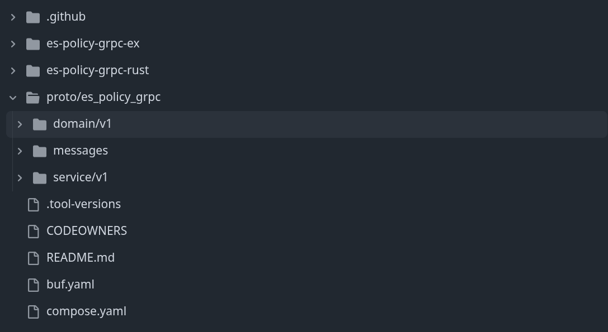
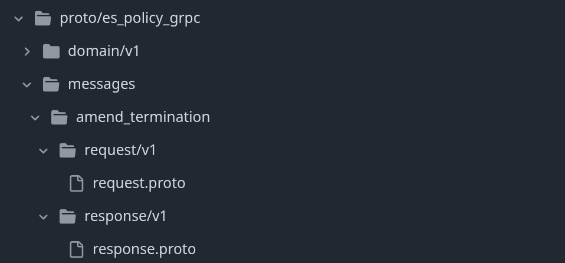
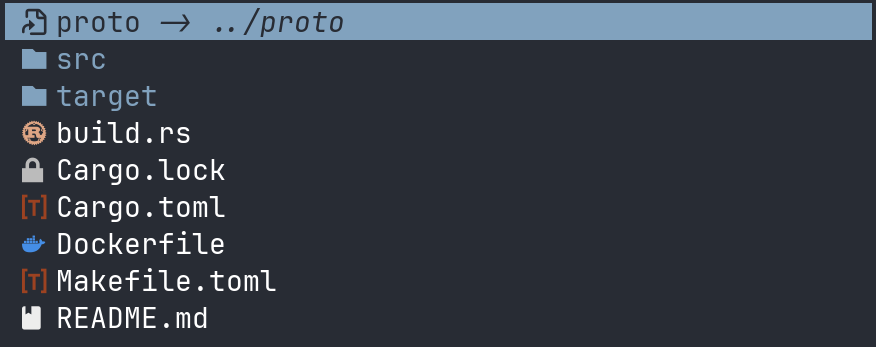

<h1>A practical guide to gRPC with</h1>

<p>Victor Martinez</p>

---

<h2>Contents</h2>

<div class="row">
  <div>

  + Ingredients to build a gRPC API
  + Defining our API with Protocol Buffers
  + Generate a Rust library
  + CI & Release flow
  
  </div>

  <div>

  + Building a gRPC server
  + How to deploy
  + How to call our server
  + How is it going so far

  </div>
</div>

---

## Ingredients to build a **gRPC API**

<div class="row">
    <!-- .element: class="fragment" data-fragment-index="1" -->
   <!-- .element: class="fragment" data-fragment-index="2" -->
</div>
 <!-- .element: class="fragment" data-fragment-index="3" -->

---

## Defining our **API**


---

## Project structure



<a href="https://github.com/primait/es-policy-grpc">https://github.com/primait/es-policy-grpc</a>

---

## Project structure



<a href="https://github.com/primait/es-policy-grpc">https://github.com/primait/es-policy-grpc</a>

---

## Defining a **request**

```proto
syntax = "proto3";

package es_policy_grpc.messages.issue_policy.request.v1;

import "es_policy_grpc/domain/v1/bundle.proto";
import "es_policy_grpc/domain/v1/coverage.proto";
import "es_policy_grpc/domain/v1/issuing_company.proto";
// ... etc

message IssuePolicyRequest {
  google.protobuf.Timestamp requested_at = 1; 
  google.protobuf.Timestamp start_at = 2;
  google.protobuf.Timestamp end_at = 3;
  google.protobuf.Timestamp purchased_at = 4;
  es_policy_grpc.domain.v1.TransactionInformation transaction = 5;
  es_policy_grpc.domain.v1.IssuingCompany issuing_company = 6;
  string quote_id = 7;
  es_policy_grpc.domain.v1.QuoteSource quote_source = 8;
  string application_id = 9;
  string offer_id = 10;
  es_policy_grpc.domain.v1.Price price = 11;
  es_policy_grpc.domain.v1.Bundle bundle = 12;
  repeated es_policy_grpc.domain.v1.ProductCover covers = 13;
  es_policy_grpc.domain.v1.PolicyHolderInformation policy_holder_information = 14;
  es_policy_grpc.domain.v1.VehicleInformation vehicle_information = 15;
  es_policy_grpc.domain.v1.QuoteVersion quote_version = 16;
} 
```

---

## Defining a **request**

```proto
syntax = "proto3";

package es_policy_grpc.domain.v1;

import "es_policy_grpc/domain/v1/price.proto";
import "google/protobuf/timestamp.proto";

message ProductCover {
  CoverType cover_type = 1;
  google.protobuf.Timestamp start_at = 2;
  google.protobuf.Timestamp end_at = 3;
  es_policy_grpc.domain.v1.Price price = 4;
  optional RoadsideAssistanceTier roadside_assistance_tier = 5;
}

enum CoverType {
  COVER_TYPE_UNSPECIFIED = 0;
  COVER_TYPE_MANDATORY_THIRD_PARTY_LIABILITY = 1;
  COVER_TYPE_VOLUNTARY_THIRD_PARTY_LIABILITY = 2;
  COVER_TYPE_DRIVER_ACCIDENT = 3;
  COVER_TYPE_WINDSHIELD = 4;
  COVER_TYPE_THEFT = 5;
  // ..etc
}

enum RoadsideAssistanceTier {
  ROADSIDE_ASSISTANCE_TIER_UNSPECIFIED = 0;
  ROADSIDE_ASSISTANCE_TIER_BASE = 1;
  ROADSIDE_ASSISTANCE_TIER_PREMIUM = 2;
  ROADSIDE_ASSISTANCE_TIER_PREMIUM_V2 = 3;
}
```

---

## Defining a **response**

```proto
syntax = "proto3";

package es_policy_grpc.messages.issue_policy.response.v1;

message IssuePolicyResponse {
  string policy_id = 1;
}
```

---

## About **backwards** compatibility

---

### Required fields don't exist, everything has a default value

+ **Strings** => The empty string.
+ **Bytes** => Empty bytes.
+ **Bools** => False.
+ **Numeric** => Zero.
+ **Message** => Not set. Its exact value is language-dependent.
+ **Enums** => The first defined enum value, which must be 0.

<a href="https://protobuf.dev/programming-guides/proto3/#default">https://protobuf.dev/programming-guides/proto3/#default</a>

---

### Enums must have an "**Unspecified**" variant

```proto
enum BundleSlug {
  BUNDLE_SLUG_UNSPECIFIED = 0;
  BUNDLE_SLUG_TERCEROS_BASICO = 1;
  BUNDLE_SLUG_TERCEROS_AMPLIADO = 2;
  BUNDLE_SLUG_TODO_RIESGO_CON_FRANQUICIA = 3;
  BUNDLE_SLUG_TODO_RIESGO_CON_FRANQUICIA_300 = 4;
  BUNDLE_SLUG_TODO_RIESGO_CON_FRANQUICIA_500 = 5;
} 
```

<a href="https://protobuf.dev/best-practices/dos-donts#unspecified-enum">https://protobuf.dev/best-practices/dos-donts/#unspecified-enum</a>

---

### Field tags must **never** be reused

And deleted fields must be marked as reserved

```proto
message AmendWithdrawalRequest {
  string policy_id = 1;
  google.protobuf.Timestamp requested_at = 2;

  reserved 3;
  reserved "interruption_at";

  optional string description = 4;
  oneof reason {
    es_policy_grpc.messages.withdraw_policy.request.v1.CustomerWithdrawReason customer = 5;
  }
}
```

<a href="https://protobuf.dev/best-practices/dos-donts#reuse-number">https://protobuf.dev/best-practices/dos-donts#reuse-number</a>

---

### Learn more about **Do's** and **Dont's**

<a href="https://protobuf.dev/best-practices/dos-donts">https://protobuf.dev/best-practices/dos-donts</a>

---

## Defining a **service**

```proto
syntax = "proto3";

package es_policy_grpc.service.v1;

import "es_policy_grpc/messages/issue_policy/request/v1/request.proto";
import "es_policy_grpc/messages/issue_policy/response/v1/response.proto";

service PolicyManagementService {
  rpc IssuePolicy(es_policy_grpc.messages.issue_policy.request.v1.IssuePolicyRequest) returns (es_policy_grpc.messages.issue_policy.response.v1.IssuePolicyResponse);
} 
```

---

<h1>Building a library</h1>


---

### Project structure



---

### Build script

```rust
use std::io::Result;

fn main() -> Result<()> {
    // List of proto files containing a message definition
    let proto_files = &[
        //Domain
        "proto/es_policy_grpc/domain/v1/address.proto",
        "proto/es_policy_grpc/domain/v1/bundle.proto",
        // etc.
        // Messages
        "proto/es_policy_grpc/messages/issue_policy/request/v1/request.proto",
        "proto/es_policy_grpc/messages/issue_policy/response/v1/response.proto",
        // Services
        "proto/es_policy_grpc/service/v1/service.proto",
    ];

    // Name of the folder containing the proto definitions
    let proto_folder = "proto";

    tonic_prost_build::configure()
        .protoc_arg("--experimental_allow_proto3_optional")
        .compile_protos(proto_files, &[proto_folder])
        .unwrap();

    Ok(())
}
```

---

### Exposing the generated code

```rust
// src/lib.rs

pub mod domain {
    pub mod v1 {
        include!(concat!(env!("OUT_DIR"), "/es_policy_grpc.domain.v1.rs",));
    }
}

pub mod messages {
    pub mod issue_policy {
        pub mod request {
            pub mod v1 {
              include!(concat!(env!("OUT_DIR"), "/es_policy_grpc.messages.issue_policy.request.v1.rs"));
            }
        }

        pub mod response {
            pub mod v1 {
                include!(concat!(env!("OUT_DIR"), "/es_policy_grpc.messages.issue_policy.response.v1.rs"));
            }
        }
    }
}

pub mod policy_service {
    pub mod v1 {
        include!(concat!(env!("OUT_DIR"), "/es_policy_grpc.service.v1.rs"));
    }
} 
```

---

<h1>CI & Release flow</h1>

---

### Buf CLI

- A **linter** for proto files
- A **formatter** for proto files
- A system to organize your proto files by **workspaces**
- A feature to check for **breaking changes** in your definitions
- A **plugin system** to compile proto files into multiple formats
- **Editor integration**
- And more!

[https://buf.build/product/cli](https://buf.build/product/cli)

note:

- Builds on top of protoc

- Provides a very easy to use plugin and build system

---

### **CI workflows:** Proto checks

```yaml
name: "Check proto"

on:
  pull_request:
    paths:
      - "proto/**"

jobs:
  check-proto:
    # ..
    steps:
        # ..
      - name: Protobuf format check
        shell: bash
        run: |
          buf format -d --exit-code

      - name: Protobuf lint
        shell: bash
        run: |
          buf lint
```

---

### **CI workflows:** Rust checks

```yaml

name: "Check rust lib"

on:
  pull_request:
    paths:
      - "es-policy-grpc-rust/**"
      - "proto/**"
      - ".github/workflows/check-rust-lib.yml"

jobs:
  check-rust-lib-compiles:
    # ..
    container:
      image: public.ecr.aws/primaassicurazioni/actions-builder:ubuntu-24.04-3
    defaults:
      run:
        working-directory: es-policy-grpc-rust
    steps:
      - uses: actions/checkout@v4
      - uses: primait/shared-github-actions/actions/install-rust@install-rust-v3
        # ..
      - name: Install protoc
        # ..
      - name: Cargo build
        run: cargo build
```

---

### **CI workflows:** Backwards compatibility check

```yaml

name: "Check backwards compatibility"

on: pull_request

jobs:
   check-backward-compatibility:
    # ..
    steps:
     - uses: actions/checkout@v4

     - name: Install buf
     # ..
     - name: Fetch master branch
       shell: bash
       run: |
         git fetch origin master:master

     - name: Check backwards compatibility against master
       shell: bash
       run: |
         buf breaking --against ".git#branch=master"
```

---

### **Release workflow**

```yaml
name: "Release Rust Crate"

on:
  push:
    tags:
      - "*"
   
jobs:
  publish:
    # ..
    steps:
      - uses: actions/checkout@v4
      - uses: primait/shared-github-actions/actions/install-rust@rust-ci-v3
      # ..
      - name: Install cargo edit
      # ..
      - name: Set release version
        working-directory: es-policy-grpc-rust
        run: |
          cargo set-version $GITHUB_REF_NAME
      - name: Retrieve vault token
        # ..
      - name: Install protoc compiler
      # ..
      - name: Publish package
        working-directory: es-policy-grpc-rust
        run: |
          cargo publish --allow-dirty
        env:
          CARGO_REGISTRIES_ARTIFACTORY_TOKEN: ${{ format('Bearer {0}', CARGO_REGISTRIES_ARTIFACTORY_TOKEN) }}
```

---

### **Release workflow:** Cargo configuration

<div class="row" style="gap: 0;">

```toml
# .cargo/config.toml

# Makes artifactory the default registry and saves passing --registry parameter
[registry]
default = "artifactory"
global-credential-providers = ["cargo:token"]

[registries]
artifactory = { index = "sparse+https://prima.jfrog.io/artifactory/api/cargo/policy-management-crates/index/" }
```

```toml
# Cargo.toml

[package]
name = "es-policy-grpc"
version = "0.6.7"
edition = "2024"
# ..
publish = ["artifactory"]  
```

</div>

---

## Building a gRPC server


---

### **Importing our library:** Required setup

```toml
# .cargo/config.toml

[registries.policy-management-crates]
index = "sparse+https://prima.jfrog.io/artifactory/api/cargo/policy-management-crates/index/"

[registry]
global-credential-providers = ["cargo:token"]
```

---

### **Importing our library:** Required setup

```toml
# ~/.cargo/credentials.toml

[registries.policy-management]
token = "Bearer <generated-token>"
```

---

### Importing our library

```toml
# Cargo.toml

es-policy-grpc = { version = "=0.6.4", registry = "policy-management-crates", features = [
  "tonic_0_14",
] }
prost = "0.14"
prost-types = "0.14"
tonic = { version = "0.14", features = [
  "gzip",
  "server",
  "tls-native-roots",
  "tls-ring",
  "tls-webpki-roots",
] }
tonic-health = "0.14"
```

---

### Implementing the service trait

```rust
// ..
use es_policy_grpc::policy_service::v1::PolicyManagementService;

pub struct PolicyManagementServiceImpl {
    application: Application,
} 

#[tonic::async_trait]
impl PolicyManagementService for PolicyManagementServiceImpl {
  // ..
}
```

---

### Implementing the service trait

```rust
// ..
impl PolicyManagementService for PolicyManagementServiceImpl {
    async fn issue_policy(
        &self,
        request: Request<IssuePolicyRequest>,
    ) -> Result<Response<IssuePolicyResponse>, Status> {
        let request = request.into_inner();

        let issue_policy = request.try_to_domain().map_err(|err| {
            Status::invalid_argument(
              format!("Failed to parse issue policy request: '{err}'")
            )
        })?;

        let policy_id = self
            .application
            .policy_service()
            .issue(issue_policy)
            .await
            .map_err(|err| Status::internal(
              format!("Error issuing policy; error '{err:?}'")
            ))?;

        Ok(Response::new(IssuePolicyResponse { policy_id: policy_id.to_string() }))
    }
}
```

---

### **Implementing the service trait:** Parsing request data

```rust
impl TryToDomain<DomainIssuePolicyRequest> for IssuePolicyRequest {
    fn try_to_domain(self) -> Result<DomainIssuePolicyRequest, ParseGrpcError> {
        Ok(DomainIssuePolicyRequest {
            start_at: self
                .start_at
                .ok_or(ParseGrpcError::MissingField("start_at"))
                .and_then(|v| {
                  parse_prost_timestamp(v).map_err(|err|
                    ParseGrpcError::InvalidField("start_at", err)
                  )
                })?,
            purchased_at: self
                .purchased_at
                .ok_or(ParseGrpcError::MissingField("purchased_at"))
                .and_then(|v| {
                  parse_prost_timestamp(v).map_err(|err|
                    ParseGrpcError::InvalidField("purchased_at", err)
                  )
                })?,
            transaction: self
                .transaction
                .clone()
                .ok_or(ParseGrpcError::MissingField("transaction"))?
                .try_to_domain()?,
            //..
        })
    }
} 
```
---

### **Implementing the service trait:** Parsing request data

```rust
impl TryToDomain<DomainIssuingCompany> for IssuingCompany {
    fn try_to_domain(self) -> Result<DomainIssuingCompany, ParseGrpcError> {
        match self {
            IssuingCompany::Unspecified => {
                Err(ParseGrpcError::UnspecifiedEnumVariant("IssuingCompany"))
            }
            IssuingCompany::Iptiq => Ok(DomainIssuingCompany::Iptiq),
            IssuingCompany::GreatLakes => Ok(DomainIssuingCompany::GreatLakes),
        }
    }
}
```

---

### **Implementing the service trait:** Parsing request data

```rust
impl TryToDomain<OwnerInfo> for OwnerInformation {
    fn try_to_domain(self) -> Result<OwnerInfo, ParseGrpcError> {
        Ok(OwnerInfo {
            name: self.first_name,
            first_last_name: self.primary_last_name,
            second_last_name: self.secondary_last_name,
            birth_date: parse_proto_naive_date(self.birth_date.ok_or(
                ParseGrpcError::MissingField("Policy vehicle owner birthdate"),
            )?)
            .map_err(|e| {
                ParseGrpcError::InvalidField("Policy vehicle owner birthdate", e.into())
            })?,
            residential_address: match self.address {
                Some(address) => Some(address.try_to_domain()?),
                None => None,
            },
            document_id: self.document,
        })
    }
}
```

---

### Exposing our server

```rust
let router = Server::builder()
    .add_service(PolicyManagementServiceServer::new(
      PolicyManagementServiceImpl::new(application)
    ));

let listener = tokio::net::TcpListener::bind(("0.0.0.0", port))
    .await
    .context("Failed to open socket connection for gRPC server")?;

router
    .serve_with_incoming(TcpListenerStream::new(listener))
    .await?;
```

---

### **Middleware:** Authentication

```rust
use prima_tower::authentication::verify_jwt::JwtAuthLayer;

// ..

let jwks_client = JwksClient::builder().build(
    WebSource::builder()
        .build(jwks_url)
        .expect("Failed to build WebSource for JwksClient"),
);

let service = ServiceBuilder::new()
    .layer(JwtAuthLayer::new(jwks_client, auth0_audience))
    .named_layer(PolicyManagementServiceServer::new(
        PolicyManagementServiceImpl::new(application),
    ));

let router = Server::builder().add_service(service);
```

---

### **Middleware:** Tracing

```rust
use prima_tower::trace::OpenTelemetryServerTracingLayer;
use tower_http::sensitive_headers::{
    SetSensitiveRequestHeadersLayer, SetSensitiveResponseHeadersLayer,
};

// ..

let service = ServiceBuilder::new()
    .layer(SetSensitiveRequestHeadersLayer::new([
        header::AUTHORIZATION,
    ]))
    .layer(OpenTelemetryServerTracingLayer::new_for_grpc())
    .layer(SetSensitiveResponseHeadersLayer::new([
        header::AUTHORIZATION,
    ]))
    // ..
    .named_layer(PolicyManagementServiceServer::new(
        PolicyManagementServiceImpl::new(application),
    ));

let router = Server::builder().add_service(service);
```

---

## **Deploying** our server

---

### **Deploying** our server

```yaml
# deploy/values/default.yml

default:
  # ..
  container:
    # ..
    environmentVars:
      language: rust
      port: 50051
      run_migrations: false
      extras:
        # .. environment vars
    ports:
      - name: grpc
        containerPort: 50051
        protocol: TCP
```

---

### **Deploying** our server

```yaml
# deploy/values/default.yml

apps:
  web:
    deployment:
      serviceAccount: web
      containers:
        main:
          environmentVars:
            role: web
          startupProbe:
            grpc:
              port: 50051
            initialDelaySeconds: 15
          livenessProbe:
            grpc:
              port: 50051
            initialDelaySeconds: 15
          readinessProbe:
            grpc:
              port: 50051
            initialDelaySeconds: 15
```

---

### **Deploying** our server

```yaml
# deploy/values/default.yml

services:
  default:
    selector: web
    spec:
      type: ClusterIP
      ports:
        - port: 50051
          targetPort: 50051
          name: web
          protocol: TCP
```

---

## Calling our server

---

### Create a client

```rust
use es_policy_grpc::{
  policy_service::v1::policy_management_service_client::PolicyManagementServiceClient
};
use tower_http::sensitive_headers::{
    SetSensitiveRequestHeadersLayer, SetSensitiveResponseHeadersLayer,
};
use prima_tower::authentication::client_credentials::{ ClientCredentials, ClientCredentialsAuth, ClientCredentialsAuthLayer, };
// ..

let uri = "http://policy-management-es.policy-management:50051";
let channel = Channel::builder(uri).connect_lazy();

let channel = ServiceBuilder::new()
    .layer(ClientCredentialsAuthLayer::new(
        prima_http::Client::standard(credentials.token_url).build(),
        credentials,
    ))
    .layer(SetSensitiveRequestHeadersLayer::new(once(
        header::AUTHORIZATION,
    )))
    .layer(OpenTelemetryClientTracingLayer::new_for_grpc())
    .layer(SetSensitiveResponseHeadersLayer::new(once(
        header::AUTHORIZATION,
    )))
    .service(channel);

let client = PolicyManagementServiceClient::new(channel);
```

---

### **Making a gRPC call:** Building the request

```rust
impl FromDomain<DomainIssuePolicyRequest> for IssuePolicyRequest {
    fn from_domain(request: DomainIssuePolicyRequest) -> Self {
        Self {
            policy_holder_information: Some(PolicyHolderInformation::from_domain(
                request.policy_holder_information(),
            )),
            vehicle_information: Some(VehicleInformation::from_domain((
                request.vehicle_information(),
                request.occasional_driver(),
            ))),
            requested_at: Some(to_prost_timestamp(Utc::now())),
            start_at: Some(to_prost_timestamp(request.start_at)),
            end_at: Some(to_prost_timestamp(request.end_at)),
            purchased_at: Some(to_prost_timestamp(request.purchased_at)),
            transaction: Some(TransactionInformation::from_domain(request.transaction)),
            issuing_company: IssuingCompany::from_domain(request.issuing_company) as i32,
            quote_id: String::from(Uuid::from(request.quote_id)),
            quote_source: QuoteSource::from_domain(request.quote_source) as i32,
            application_id: String::from(Uuid::from(request.application_id)),
            offer_id: String::from(Uuid::from(request.offer_id)),
            price: Some(Price::from_domain(request.price)),
            bundle: Some(Bundle::from_domain(request.bundle)),
            covers: request.covers.into_iter().map(ProductCover::from_domain).collect(),
            quote_version: QuoteVersion::from_domain(request.terms_and_conditions) as i32,
        }
    }
}  
```

---

### Making a gRPC call

```rust
let response = client
    .issue_policy(IssuePolicyRequest::from_domain(issue_policy_request))
    .await
    .map_err(|status| GrpcError::BadResponse(status.to_string()))?
    .into_inner();

let policy_id = Uuid::parse_str(&response.policy_id).expect("policy_id should always be a valid uuid");
```

---

## How is it going so far?

---

### Domains using our gRPC client

+ **Backoffice**
+ **Pricing & Underwriting**

---

### **How are they using it:** Backoffice

The **Customer Support Spain UK** team has been using our **Rust** library for a few months.

Currently they are making use of the following operations: 


<div class="row">
  <div>

  + *terminate_policy*
  + *withdraw_policy*
  + *update_policy_holder_email*
  + *send_policy_contract_email*
  + *find_corrected_email*
  + *amend_termination*
  + *decline_renewal*
  
  </div>

  <div>

  + *generate_contract*
  + *amend_withdrawal*
  + *find_by_application_id*
  + *find_by_cfid*
  + *find_by_id*
  + *search*

  </div>
</div>

---


### **How are they using it:** Pricing & Underwriting

The **Underwriting Processes** team is using the **Elixir** library to generate a pre-signed url of a contract.

So far it's been a success :smile:


